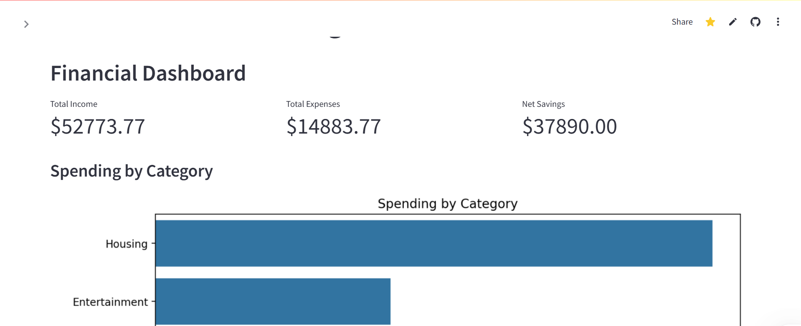
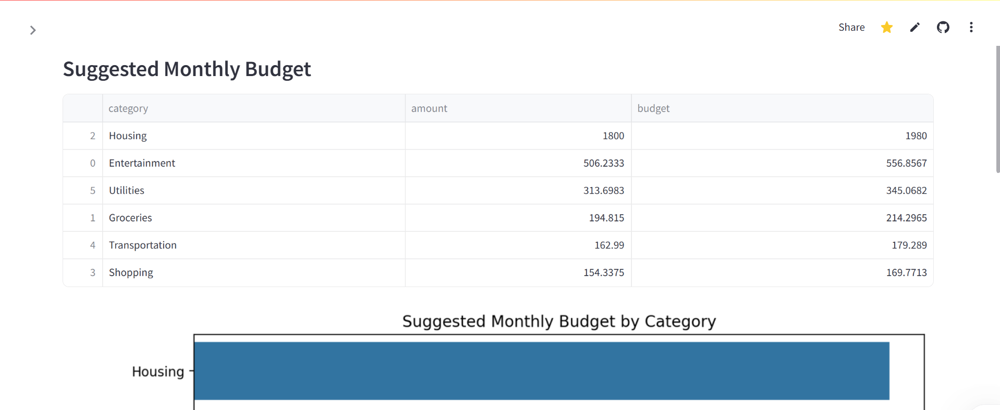

# 💰 Personal Finance Tracker

An interactive web app that helps you track expenses, detect recurring payments, and plan monthly budgets — powered by Streamlit and machine learning.

## 🔗 Live Demo

👉 [Try it on Streamlit Cloud](https://personal-finance-tracker-smolry.streamlit.app/)

## 📸 Screenshots

| Dashboard | Insights | Budget Planner |
|----------|----------|----------------|
|  |  |  |

## ✨ Features

- 📊 Expense tracking and categorization (ML + rule-based)
- 🔁 Detect recurring transactions (e.g., subscriptions, bills)
- 📅 Monthly budget planning with suggestions
- 📈 Visual dashboards and insights
- 💾 Save to SQLite (optional)

## 📁 Project Structure
├── app.py # Streamlit app
├── src/
│ ├── categorizer.py
│ ├── ml_categorizer.py
│ ├── data_loader.py
│ └── insights.py
├── scripts/
│ └── create_sample_data.py
├── data/
│ └── (generated at runtime)
├── requirements.txt
└── .gitignore


## 🛠 How to Run Locally

1. Clone the repo:
   ```bash
   git clone https://github.com/YOUR_USERNAME/YOUR_REPO.git
   cd YOUR_REPO

2. Create virtual environment and install dependencies:
python -m venv venv
venv\Scripts\activate  
source venv/bin/activate  
pip install -r requirements.txt

3. Run the app:
streamlit run app.py


## 🧠 ML Categorization
Trains a Random Forest classifier using TF-IDF vectorization of descriptions. If not trained, falls back to rule-based keyword matching.


## 📚 Data
Accepts CSVs with columns: Date, Description, Amount

Auto-formats columns

Sample dataset available in /data/raw/sample_transactions.csv
