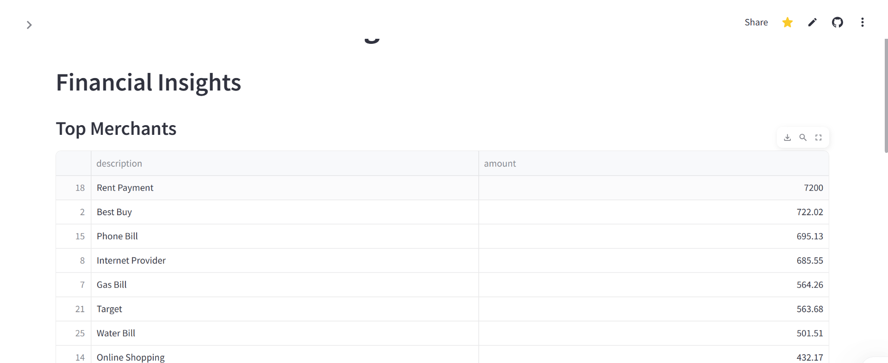

# 💰 Personal Finance Tracker

An interactive web app that helps you track expenses, detect recurring payments, and plan monthly budgets — powered by Streamlit and machine learning.

## 🔗 Live Demo

👉 [Try it on Streamlit Cloud](https://personal-finance-tracker-smolry.streamlit.app/)

## 📸 Screenshots

| Dashboard | Insights | Budget Planner |
|----------|----------|----------------|
|  |  |  |

## ✨ Features

- 📊 Expense tracking and categorization (ML + rule-based)
- 🔁 Detect recurring transactions (e.g., subscriptions, bills)
- 📅 Monthly budget planning with suggestions
- 📈 Visual dashboards and insights
- 💾 Save to SQLite (optional)

## 📁 Project Structure

